# real_estate_datas

# 概要
不動産取引価格情報取得API（国交省）のデータ概要
- https://www.land.mlit.go.jp/webland/api.html
- 指定した期間の指定した地域(都道府県、市区町村)の物件の取引データ
- 最寄り駅のデータはない

# 項目の概要
## 各列の概要
### Type
- 取引の種類['宅地(土地と建物)', '中古マンション等', '宅地(土地)', '農地', '林地']
- "宅地(土地)"はほぼTotalFloorAreaがNanなので、建物が立っていない土地
### Region
- ['住宅地', nan, '商業地', '工業地', '宅地見込地']
### MunicipalityCode
- 市区町村コード(5桁の数字)
### Prefecture
- 都道府県(文字列) 
  - ex:北海道
### Municipality
- 市区町村名(文字列) 
  - ex:札幌市中央区
### DistrictName
- 地区名 
  - ex:旭ヶ丘 大通り西
### TradePrice
- 価格
- astype('int')可能
### PricePerUnit
- 坪単価
- astype('float')可能　Nanあり
### Area
- 面積
- 「㎡以上」の文字列を除去すればint可能(['2000㎡以上', '5000㎡以上']の二つがあるっぽい)
- おそらくだが、集合住宅では部屋の面積を、一軒家では土地の面積を表しているので、居住部の面積を一軒家とマンションで比較する場合は注意
- (一軒家ではTotalFloorAreaがそれにあたる)
### LandShape
- ['台形', nan, '長方形', 'ほぼ整形', '不整形', 'ほぼ長方形', 'ほぼ正方形', '正方形', 'ほぼ台形','袋地等']
### Frontage
- 間口
  - 道路や通りに面する長さ。
- 2m未満は再建築不可のため、よろしくない。
- m2抜きで、floatOK
### UnitPrice
- 取引価格(平方メートル単価)
- float
### TotalFloorArea
- 延床面積。建物面積ともいう。
- 「㎡以上」文字列除去でfloat可能
### BuildingYear
- 築年。(なんで和暦なんだよ)
- ['平成2年', '平成19年',戦前、nan...]
### Structure
- ['木造', 'ＲＣ', 'ＳＲＣ', nan, '鉄骨造', '軽量鉄骨造', 'ＲＣ、木造', 'ブロック造', 'ＲＣ、鉄骨造','鉄骨造、木造', '木造、ブロック造', 'ＲＣ、ブロック造']
### Use 
- 用途。
- ['住宅', nan, '共同住宅',..]。住宅と共同住宅が大半
### Purpose
- 今後の利用目的。
- 古いデータにはないので注意。
- ['住宅', 'その他', '店舗', '事務所', nan, '工場', '倉庫']
### Direction
- 前面道路の方位
### Classification
- 前面道路の種類
- 私道、国道、県道 etc.
### Breadth
- 前面道路の道幅。
- floatOK
### CityPlanning
- 都市計画
- ['第１種住居地域', '商業地域'..]
- 参考：https://iqrafudosan.com/channel/urban-planning-japan
### CoverageRatio 
- 建蔽率
- だいたい60%が多い。用途地域によって制限があるぽい。
- nanあるが、n*10の整数
### FloorAreaRatio
- 容積率。
- 用途地域によって制限があるらしい
### Period
- 取引時期 
- APIパラメータで指定するやつ。['2022年第１四半期', '2022年第４四半期'...]
### FloorPlan
- [nan, '２ＬＤＫ', '３ＬＤＫ', '１Ｒ＋Ｓ'...]
### Renovation
- 改装有無。[nan, '改装済', '未改装']
### Remarks
- 取引の事情等。
- [nan, '調停・競売等', '私道を含む取引', '隣地の購入', '関係者間取引', '古屋付き・取壊し前提']。
- 大半がNan

## 不要な列
分析したい意図と合わないのでデータ量削減のため、という意図
- PricePerUnit
- UnitPrice
- Purpose
- Direction
- Classification
- Remarks(nanだけに絞ったあとで)

## 各列の下処理
- Type: 特になし
- Region: 特になし
- MunicipalityCode: 特になし
- Prefecture: コード化して正規化するかどうか
- DistrictName: 特になし
- TradePrice: int、万円にする
- PricePerUnit: float
- Area: m2消す、float
- LandShape; 特になし
- Frontage: m2消す、float
- UnitPrice: float
- TotalFloorArea: m2消す、float
- BuildingYear: 西暦に直す+築年列を作る
- Structure: 特になし
- Use: 特になし
- Purpose: 特になし
- Direction: 特になし
- Classification: 特になし
- Breadth: 特になし
- CityPlanning: 特になし。ちょっと正規化したい
- CoverageRatio: float
- FloorAreaRatio: float
- Period: XXXX年第Y四半期を年とYに分ける
- FloorPlan: 特になし
- Renovation: 特になし
- Remarks: 特になし。

# データの概観

## カテゴリデータ

### 今回の分析用の加工メモ
- Type:
  - 土地はいらないので、宅地(土地と建物)・中古マンション等の二つに絞る
- Structure
  - 美しくないから、データ数少ないのは"その他"にしたい。
  - 木造, Nan, ＲＣ, ＳＲＣ, 軽量鉄骨造, 鉄骨造,ブロック造以外はその他かな
- Use
  - 住宅用途に絞る。
  - 住宅,Nan,共同住宅,住宅の3つ以外は消そう(90%以上確保できる)
- Purpose
  - Useと同様
  - 住宅とNanにしぼる。Nan消しても良いが。。
- CityPlanning
  - よくわからないので、一旦そのまま。
  - 他の絞れば、絞られそう。
- Region
- Municipality
- LandShape
- Period
- FloorPlan
- Renovation
  - 絞らない
  - 
### 各カテゴリの分布
- 各カテゴリごとのデータ数と、全体に占める割合を出力
- 神奈川県の、2021-2022年のデータで確認。
- カテゴリ数が多いデータは、適宜列を除去している(max15)。
 
#### Municipality
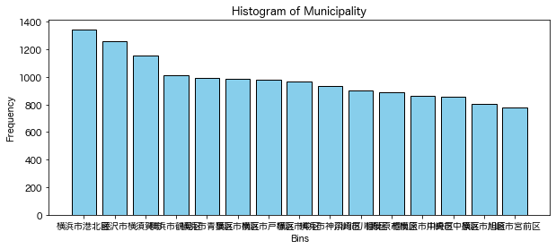
|                    |   横浜市港北区 |   藤沢市 |   横須賀市 |   横浜市鶴見区 |   横浜市青葉区 |   横浜市南区 |   横浜市戸塚区 |   横浜市中区 |   横浜市神奈川区 |   川崎市川崎区 |   相模原市南区 |   相模原市中央区 |   川崎市中原区 |   横浜市旭区 |   川崎市宮前区 |
|:-------------------|---------------:|---------:|-----------:|---------------:|---------------:|-------------:|---------------:|-------------:|-----------------:|---------------:|---------------:|-----------------:|---------------:|-------------:|---------------:|
| Municipality_count |         1346   |   1262   |     1157   |         1014   |          991   |        986   |          983   |        969   |            933   |          905   |            892 |            864   |          859   |        807   |          780   |
| Municipality(%)    |            4.6 |      4.3 |        3.9 |            3.4 |            3.4 |          3.3 |            3.3 |          3.3 |              3.2 |            3.1 |              3 |              2.9 |            2.9 |          2.7 |            2.6 |

#### DistrictName
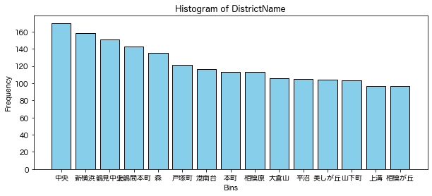

|                    |   中央 |   新横浜 |   鶴見中央 |   上鶴間本町 |    森 |   戸塚町 |   港南台 |   本町 |   相模原 |   大倉山 |   平沼 |   美しが丘 |   山下町 |   上溝 |   相模が丘 |
|:-------------------|-------:|---------:|-----------:|-------------:|------:|---------:|---------:|-------:|---------:|---------:|-------:|-----------:|---------:|-------:|-----------:|
| DistrictName_count |  170   |    158   |      151   |        143   | 135   |    121   |    116   |  113   |    113   |    106   |  105   |      104   |    103   |   97   |       97   |
| DistrictName(%)    |    0.6 |      0.5 |        0.5 |          0.5 |   0.5 |      0.4 |      0.4 |    0.4 |      0.4 |      0.4 |    0.4 |        0.4 |      0.3 |    0.3 |        0.3 |

#### Type
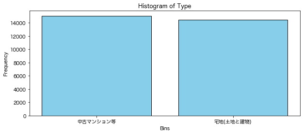
|            |   中古マンション等 |   宅地(土地と建物) |
|:-----------|-------------------:|-------------------:|
| Type_count |              15062 |              14486 |
| Type(%)    |                 51 |                 49 |

|              |   Nan |   住宅地 |   商業地 |   工業地 |
|:-------------|------:|---------:|---------:|---------:|
| Region_count | 15062 |  14267   |    206   |       13 |
| Region(%)    |    51 |     48.3 |      0.7 |        0 |

#### LandShape
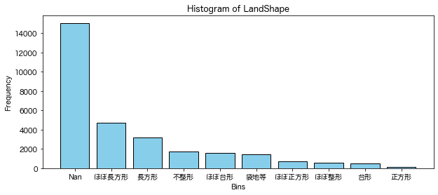
|                 |   Nan |   ほぼ長方形 |   長方形 |   不整形 |   ほぼ台形 |   袋地等 |   ほぼ正方形 |   ほぼ整形 |   台形 |   正方形 |
|:----------------|------:|-------------:|---------:|---------:|-----------:|---------:|-------------:|-----------:|-------:|---------:|
| LandShape_count | 15062 |       4680   |   3197   |   1719   |     1587   |   1411   |        688   |        603 |  493   |    108   |
| LandShape(%)    |    51 |         15.8 |     10.8 |      5.8 |        5.4 |      4.8 |          2.3 |          2 |    1.7 |      0.4 |

#### Structure
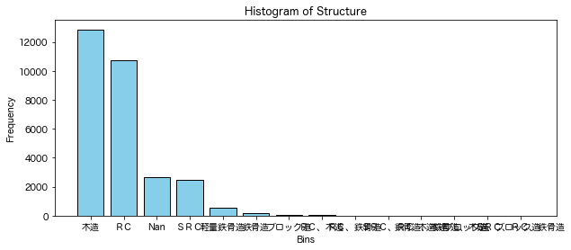
|                 |    木造 |    ＲＣ |    Nan |   ＳＲＣ |   軽量鉄骨造 |   鉄骨造 |   ブロック造 |   ＲＣ、木造 |   ＲＣ、鉄骨造 |   ＳＲＣ、ＲＣ |   鉄骨造、木造 |   木造、ブロック造 |   鉄骨造、木造、ブロック造 |   ＳＲＣ、ＲＣ、鉄骨造 |
|:----------------|--------:|--------:|-------:|---------:|-------------:|---------:|-------------:|-------------:|---------------:|---------------:|---------------:|-------------------:|---------------------------:|-----------------------:|
| Structure_count | 12858   | 10737   | 2685   |   2467   |        550   |    187   |         19   |         19   |             13 |              7 |              3 |                  1 |                          1 |                      1 |
| Structure(%)    |    43.5 |    36.3 |    9.1 |      8.3 |          1.9 |      0.6 |          0.1 |          0.1 |              0 |              0 |              0 |                  0 |                          0 |                      0 |

#### Use
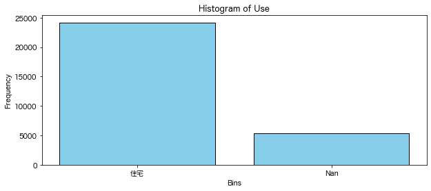
|           |    住宅 |    Nan |
|:----------|--------:|-------:|
| Use_count | 24184   | 5364   |
| Use(%)    |    81.8 |   18.2 |

#### Purpose
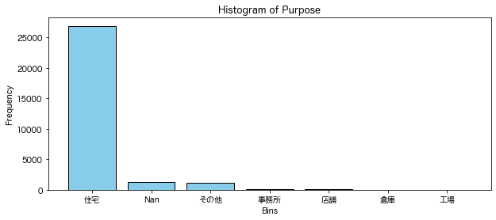
|               |   住宅 |    Nan |   その他 |   事務所 |   店舗 |   倉庫 |   工場 |
|:--------------|-------:|-------:|---------:|---------:|-------:|-------:|-------:|
| Purpose_count |  26889 | 1248   |   1200   |    135   |   47   |   24   |      5 |
| Purpose(%)    |     91 |    4.2 |      4.1 |      0.5 |    0.2 |    0.1 |      0 |

#### CityPlanning
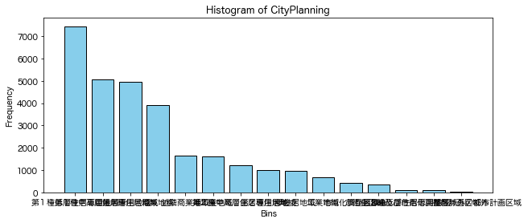
|                    |   第１種低層住居専用地域 |   第１種中高層住居専用地域 |   第１種住居地域 |   商業地域 |   近隣商業地域 |   準工業地域 |   第２種中高層住居専用地域 |   第２種住居地域 |   準住居地域 |   工業地域 |   市街化調整区域 |   Nan |   第２種低層住居専用地域 |   市街化区域及び市街化調整区域外の都市計画区域 |   都市計画区域外 |
|:-------------------|-------------------------:|---------------------------:|-----------------:|-----------:|---------------:|-------------:|---------------------------:|-----------------:|-------------:|-----------:|-----------------:|------:|-------------------------:|-----------------------------------------------:|-----------------:|
| CityPlanning_count |                   7447   |                     5066   |           4942   |     3909   |         1664   |       1626   |                     1220   |           1006   |        958   |      688   |            436   | 364   |                    100   |                                           98   |               14 |
| CityPlanning(%)    |                     25.2 |                       17.1 |             16.7 |       13.2 |            5.6 |          5.5 |                        4.1 |              3.4 |          3.2 |        2.3 |              1.5 |   1.2 |                      0.3 |                                            0.3 |                0 |

#### Period
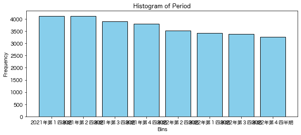
|              |   2021年第１四半期 |   2021年第２四半期 |   2021年第３四半期 |   2021年第４四半期 |   2022年第２四半期 |   2022年第１四半期 |   2022年第３四半期 |   2022年第４四半期 |
|:-------------|-------------------:|-------------------:|-------------------:|-------------------:|-------------------:|-------------------:|-------------------:|-------------------:|
| Period_count |               4127 |             4117   |             3908   |             3800   |               3531 |             3428   |             3378   |               3259 |
| Period(%)    |                 14 |               13.9 |               13.2 |               12.9 |                 12 |               11.6 |               11.4 |                 11 |

#### FloorPlan
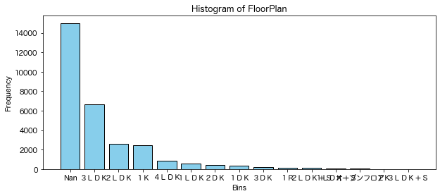
|                 |     Nan |   ３ＬＤＫ |   ２ＬＤＫ |   １Ｋ |   ４ＬＤＫ |   １ＬＤＫ |   ２ＤＫ |   １ＤＫ |   ３ＤＫ |   １Ｒ |   ２ＬＤＫ＋Ｓ |   １ＬＤＫ＋Ｓ |   オープンフロア |   ２Ｋ |   ３ＬＤＫ＋Ｓ |
|:----------------|--------:|-----------:|-----------:|-------:|-----------:|-----------:|---------:|---------:|---------:|-------:|---------------:|---------------:|-----------------:|-------:|---------------:|
| FloorPlan_count | 15002   |     6654   |     2607   | 2469   |      867   |        599 |    420   |    316   |    211   |  147   |          106   |           34   |             30   |   16   |             14 |
| FloorPlan(%)    |    50.8 |       22.5 |        8.8 |    8.4 |        2.9 |          2 |      1.4 |      1.1 |      0.7 |    0.5 |            0.4 |            0.1 |              0.1 |    0.1 |              0 |

#### Renovation
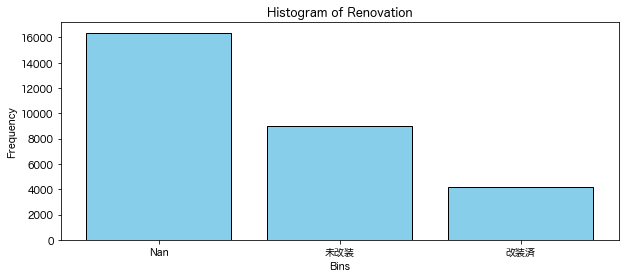
|                  |     Nan |   未改装 |   改装済 |
|:-----------------|--------:|---------:|---------:|
| Renovation_count | 16372   |   9004   |   4172   |
| Renovation(%)    |    55.4 |     30.5 |     14.1 |

## 非カテゴリデータ
データの条件は、カテゴリデータと同様

### 各非カテゴリデータの分布

#### AgeAtTrade
取引時の物件の築年数("-2"はおそらく建築未完了)
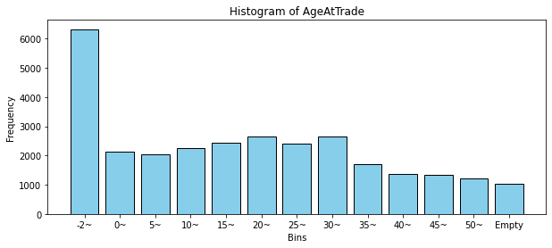

#### Area
建物面積

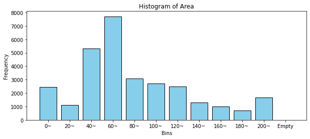

#### Breadth
前面道路の道幅

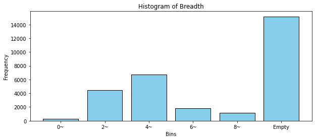

#### CoverageRatio
建ぺい率

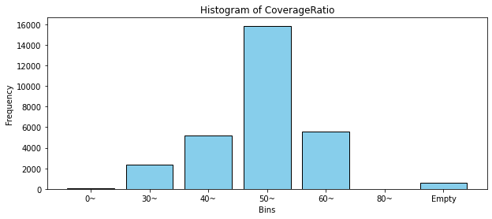

#### FloorAreaRatio
容積率

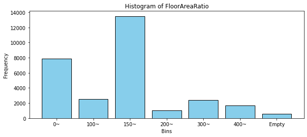

#### TotalFloorArea
延床面積(建物面積)

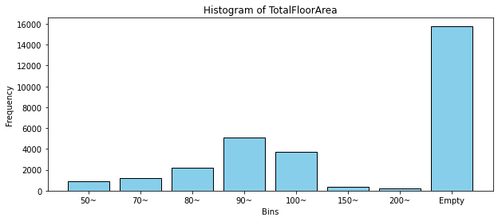

#### TradePrice
取引価格(万円)

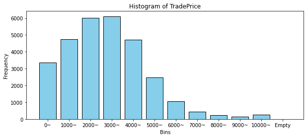

## 新規作成した列
前処理の段階で、新規に作成した列
### XXX_over_flag / XXX_under_flag
Area等にある"200m以上"や"10m以下"などの文字列を抽出して、記載があったものにflagを立てる列。  
基本的にそれらは外れ値なのであまり気にしないが、情報が消えるのが懸念なので一応残してある。

### BuildingYearW
BuildingYear(和暦)を、西暦にしたもの

### TradeYear / TradeQuarter
Period(取引時期)が2022年第一四半期等の文字列のため、それらを2022 / 1などの数字に置き換えたもの

### AgeAtTrade
取引時の物件の築年数。TradeYearとBuildYearWから作成。

### Classified_XXX_int, Classified_XXX_str
一部の数値列を階級化したもの。intはその階級の始値を、strはx~yの表記。